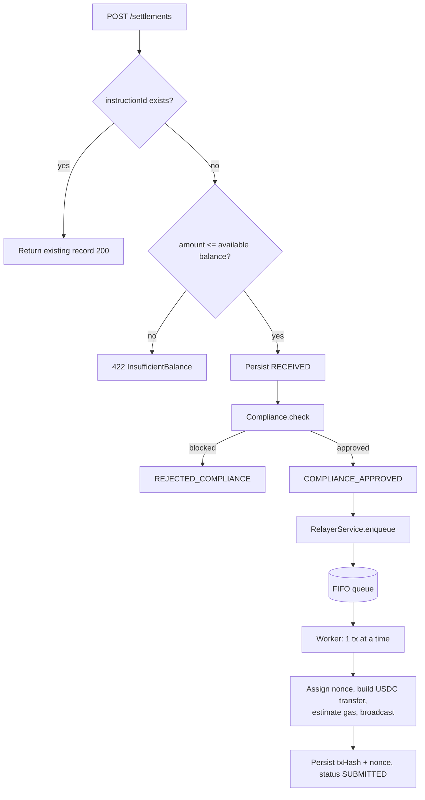
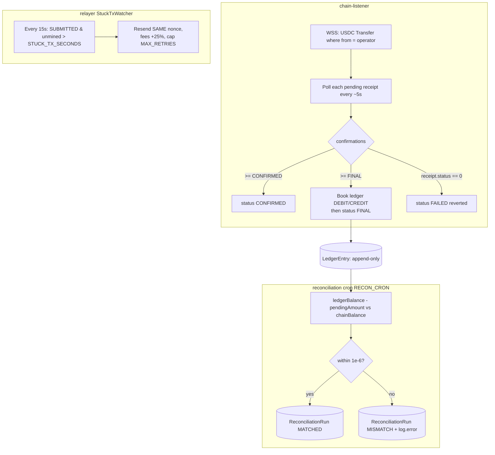

<!-- Update OWNER/REPO below to your GitHub path so the badge resolves. -->
[](https://github.com/Shahid-Nawaz-Pahore/usdc-settlement/actions/workflows/ci.yml)

# settlement-rail

A minimal clearing-to-chain integration layer: it accepts settlement instructions over REST and settles them as USDC (ERC-20) transfers on **Ethereum Sepolia** through a self-built relayer — tracking confirmations from chain events, maintaining a double-entry internal ledger in Postgres, and continuously reconciling the ledger against the on-chain balance. The interesting engineering is the relayer (strict nonce discipline, gas-bump resends, restart recovery) and the listener-driven, reconciled ledger that treats the chain as the source of truth.

Live behavior is evidenced in **[TESTING.md](TESTING.md)** with real transaction links.

## Run in 5 minutes (Docker)

```bash
cp .env.example .env
# edit .env: set OPERATOR_PRIVATE_KEY (funded Sepolia signer) + RPC_HTTP_URL/RPC_WSS_URL
docker compose up --build
```

This starts Postgres, applies migrations, and boots the API:

- API → <http://localhost:3000>
- Swagger UI → <http://localhost:3000/api/docs>
- Health → <http://localhost:3000/health>

Then submit a settlement and watch it finalize:

```bash
curl -s -X POST localhost:3000/settlements -H 'content-type: application/json' \
  -d '{"instructionId":"inv-001","toAddress":"0xAnExternalChecksummedAddr","amount":"0.5"}'
curl -s localhost:3000/reconciliation     # -> {"status":"MATCHED", ...}
```

Optional dashboard: `cd frontend && npm install && npm start` → <http://localhost:3001>.

Faucets for a funded operator: ETH from a Sepolia faucet; USDC from <https://faucet.circle.com> (select *Ethereum Sepolia*).

---

## Architecture

Two independent flows meet at the database. The **submission path** turns an instruction into a broadcast transaction; the **confirmation / reconciliation loop** watches the chain, finalizes the ledger, and proves the books match.

### Flow 1 — Submission path (request → broadcast)



The relayer worker is strictly sequential — exactly one transaction in flight from the operator wallet at a time (see [Design decisions](#design-decisions)).

### Flow 2 — Confirmation & reconciliation loop (chain → books)



### Status lifecycle

```text
RECEIVED ─┬─> REJECTED_COMPLIANCE                         (blocked recipient — terminal)
          └─> COMPLIANCE_APPROVED ─> SUBMITTED ─┬─> CONFIRMED ─> FINAL   (booked in ledger)
                                                ├─> FAILED              (revert / stuck / max retries)
                                                └─> (FINAL directly if depth jumps past CONFIRMED)
```

| Status | Meaning |
| --- | --- |
| `RECEIVED` | Persisted, not yet screened |
| `REJECTED_COMPLIANCE` | Recipient on the blocklist — terminal |
| `COMPLIANCE_APPROVED` | Screened, queued for the relayer |
| `SUBMITTED` | Broadcast on-chain with a txHash + nonce |
| `CONFIRMED` | Mined to `CONFIRMATIONS_CONFIRMED` depth |
| `FINAL` | Mined to `CONFIRMATIONS_FINAL` depth; ledger booked |
| `FAILED` | Reverted, stuck past retries, or permanent send error |

Every status change appends a `StatusTransition` row **inside the same DB transaction** as the update, giving an immutable audit trail.

---

## Design decisions

Each below is framed as **Decision · Why · Production evolution**.

### Self-built relayer (not a managed service)

- **Decision.** Build the relayer in-process rather than using Gelato / OpenZeppelin Defender.
- **Why.** A managed relayer hides exactly the part worth owning: nonce discipline and resend policy. The worker fetches the operator's pending nonce **once** at boot, tracks it locally, and increments only on an accepted broadcast; a mutex serializes new sends and gas-bump resends so they can never interleave. One in-flight tx at a time means a strict, gap-free nonce sequence — a gap or reuse would wedge the whole account.
- **Production evolution.** Shard across a pool of operator wallets (per-wallet nonce isolation → real parallelism) behind a `WalletPool`, and/or front it with a managed relayer for gas abstraction — leaving the confirmation/ledger core untouched.

### Listener as source of truth

- **Decision.** Confirmation and finalization are decided by reading chain receipts to a configured depth, never by the send call returning.
- **Why.** "Broadcast accepted" is not "settled." The WSS `Transfer(from=operator)` subscription is a fast nudge; a 5-second receipt poll is the authority and the safety net if an event is missed. Reorgs and dropped txs are handled because state is always re-derived from receipts.
- **Production evolution.** Add reorg-aware finality (track block hashes, not just depth), a dead-letter path for permanently stuck txs, and an indexer (e.g. a subgraph) if event volume grows beyond per-receipt polling.

### Double-entry ledger + independent reconciliation

- **Decision.** Each finalized settlement writes one `DEBIT OPERATOR` and one `CREDIT SETTLED_OUT`; a separate job checks `ledgerBalance − pendingAmount ≈ chainBalance`.
- **Why.** A self-balancing, append-only ledger makes the books auditable, and an *independent* reconciler catches divergence the writer can't see itself causing. A mismatch is logged loudly with every number and **never auto-corrected** — silent "fixing" would destroy the evidence a human needs.
- **Production evolution.** Per-client sub-ledgers and balances, scheduled reconciliation reports, and alerting (PagerDuty/Slack) on any MISMATCH with automatic freeze of new settlements.

### Idempotency

- **Decision.** `instructionId` carries a DB unique constraint; finalization is guarded by `unique(settlementId, account)`.
- **Why.** The create path returns the existing record on a fast pre-check **and** catches the unique-violation (`P2002`) race on insert, so concurrent identical POSTs converge on one settlement and enqueue exactly once. The ledger constraint means a duplicate `Transfer` event or reconnect re-check can't double-book.
- **Production evolution.** Add request signing / idempotency keys per API client and a short-TTL response cache so retried POSTs return the original response body verbatim.

### Restart recovery

- **Decision.** On boot the relayer reconciles every `SUBMITTED` row against the chain; finalization books the ledger **before** flipping status to `FINAL`.
- **Why.** Mined-ok is left for the listener; mined-reverted is failed; in-mempool resumes stuck-tx tracking; dropped is re-queued with the **same** stored nonce. Booking the ledger first means a crash in between is replayed safely instead of orphaning the entry. The listener also re-checks open settlements on every WSS reconnect.
- **Production evolution.** Move the in-process FIFO queue to a durable queue (Redis/SQS) so work survives a hard crash without relying on DB re-scan, and add idempotent outbox-pattern writes.

### Server-side signing (custodial) vs wallet-connect

- **Decision.** The operator key lives on the server; the backend signs and broadcasts. There is no browser wallet.
- **Why.** This is a *settlement rail*, not a user-facing dApp: a back-office process pays counterparties from a treasury, so signing is a server responsibility. It also keeps nonce management in one place (impossible if a human wallet signed concurrently). The key is read in exactly one spot, never logged, and supplied via env/secret.
- **Production evolution.** Move signing to a KMS/HSM or a threshold-signing service (Fireblocks-style), with the key never in application memory; add an approval workflow (RBAC + multi-party sign-off) for large settlements.

### Postgres for the ledger

- **Decision.** The ledger, settlements, transitions, and reconciliation runs live in Postgres via Prisma, with `DECIMAL(38,6)` money columns.
- **Why.** Financial records need ACID transactions (status + audit row written atomically), strong constraints (the unique guards above), and exact decimal arithmetic — no floats anywhere. Prisma gives typed access and migrations.
- **Production evolution.** Read replicas for reporting, partitioning the append-only tables by time, and point-in-time recovery / WAL archiving for audit retention.

---

## Roadmap (deliberately out of scope)

Listed to show the intended shape, not because they're half-built:

- **Multi-chain via CCTP** — burn-and-mint USDC across chains instead of assuming a pre-funded operator per chain.
- **Inbound deposit flows** — per-client deposit addresses with automated sweeping into the treasury, plus deposit-side ledger entries.
- **Real compliance** — a Chainalysis / TRM Labs adapter behind the existing `IComplianceProvider` (the swap point already exists).
- **RBAC for the operations console** — roles, approvals, and audit for human operators.
- **WebSocket push** — replace the dashboard's polling with server-pushed status updates.
- **CPN participant integration** — connect to a cross-border payments network for real corridors.

---

## Configuration

All variables are validated by a Joi schema at boot (fail fast). See **[.env.example](.env.example)** for the full annotated list. Highlights:

| Variable | Purpose |
| --- | --- |
| `OPERATOR_PRIVATE_KEY` | Treasury signer (never logged; 0x prefix optional) |
| `RPC_HTTP_URL` / `RPC_WSS_URL` | Alchemy Ethereum Sepolia endpoints |
| `USDC_CONTRACT_ADDRESS` | Circle USDC on Sepolia |
| `DATABASE_URL` | Postgres connection string |
| `CONFIRMATIONS_CONFIRMED` / `CONFIRMATIONS_FINAL` | Block depths for CONFIRMED / FINAL |
| `STUCK_TX_SECONDS` / `MAX_RETRIES` | Gas-bump threshold and retry cap |
| `RECON_CRON` | Reconciliation schedule |
| `ALLOWED_ORIGIN` | CORS allowlist (comma-separated; never `*`) |
| `THROTTLE_TTL_SECONDS` / `THROTTLE_LIMIT` | Rate limit for `POST /settlements` |

## Setup (without Docker)

```bash
npm install                 # also runs `prisma generate`
npm run db:migrate          # apply migrations to your DATABASE_URL
npm run start:dev
```

On first boot the service snapshots the operator's on-chain USDC balance as the ledger **opening balance** (a single `GENESIS` entry).

## Tests

```bash
npm run lint:check          # eslint (no autofix)
npm run format:check        # prettier check
npm test                    # unit tests — no DB/RPC needed (dependencies mocked)
npm run build
```

Live, on-chain verification (the real evidence) is in **[TESTING.md](TESTING.md)**, driven by `scripts/live-verify.mjs`.

---

## API reference

All errors share the shape `{ statusCode, error, message }`. A global `ValidationPipe` (`whitelist: true`) strips unknown fields; `helmet`, CORS (env allowlist), and rate limiting are enabled. Full interactive docs at **`/api/docs`**.

### `POST /settlements`

Create (or idempotently return) a settlement. Rate-limited.

```json
{ "instructionId": "inv-001", "toAddress": "0xAbc...123", "amount": "0.5" }
```

Validation: `instructionId` non-empty ≤ 64 chars · `toAddress` checksummed EVM address · `amount` positive, ≤ 6 decimals, as a string.

- `201` — new settlement accepted.
- `200` — `instructionId` already existed (returns the stored record).
- `422` — `amount` exceeds available balance.
- `400` — validation failure.
- `429` — rate limit exceeded.

### `GET /settlements`

All settlements, newest first, each enriched with a live `confirmations` count while in flight.

### `GET /settlements/:id`

A single settlement, or `404`.

### `GET /ledger/balance`

```json
{ "operatorBalance": "...", "inFlightAmount": "...", "availableBalance": "..." }
```

`availableBalance = operatorBalance − inFlightAmount` — what a new settlement can draw against.

### `GET /reconciliation`

Runs reconciliation on demand and returns the persisted `ReconciliationRun` (`MATCHED` / `MISMATCH`). The same run executes on the `RECON_CRON` schedule.

### `GET /health`

Liveness probe: `{ "status": "ok" }`.

---

## Dashboard (frontend)

A React + Tailwind operator dashboard in [`frontend/`](frontend/) (Create React App + CRACO). Submit settlements, watch them flow `RECEIVED → FINAL` with live confirmation counts, see the ledger balance, and trigger reconciliation.

```bash
# Terminal 1 — backend on :3000
npm run start:dev
# Terminal 2 — dashboard on :3001
cd frontend && npm install && npm start
```

In dev the frontend (`:3001`) proxies API calls to `:3000`, so there's no CORS. For a deployed build, set `REACT_APP_API_URL` (API origin) and `REACT_APP_EXPLORER_BASE_URL`; the backend's `ALLOWED_ORIGIN` must include the dashboard origin. Recipient addresses are checksum-validated client-side with ethers; `txHash`es link out to Etherscan.

---

## Module map

| Module | Responsibility |
| --- | --- |
| `config` | Joi-validated env + typed `AppConfigService` |
| `prisma` | Prisma 7 client (pg driver adapter) |
| `chain` | HTTP/WSS providers, operator wallet, USDC contract, WSS auto-reconnect |
| `ledger` | Append-only double-entry ledger + opening snapshot |
| `compliance` | `IComplianceProvider` + mock blocklist (swap point) |
| `settlement-state` | Settlement repository + atomic status-transition writes |
| `relayer` | FIFO worker, nonce management, gas-bump `StuckTxWatcher`, restart recovery |
| `chain-listener` | Transfer subscription + receipt-depth confirmations + finalization |
| `settlements` | REST API, idempotency, balance checks, presenter |
| `reconciliation` | Ledger-vs-chain check (cron + on demand) |
| `health` | Liveness probe for container/orchestrator checks |

> **Money math** uses `Prisma.Decimal` / `bigint` (base units via the contract's `decimals`) — never floating point.
>
> **Stack note:** Prisma 7 moves the datasource URL into `prisma.config.ts` and requires a driver adapter, so `PrismaService` is constructed with `@prisma/adapter-pg`.
